<center>
  <font face="黑体" size = 8>
   MiniSQL实验报告
  </font>
   <center><font face="黑体" size =5>
   ——《数据库系统》大实验
  </font>
</center> 

# 系统架构和概览

本实验中，使用了`C++`实现了一个精简型单用户SQL引擎MiniSQL，允许用户通过字符界面输入SQL语句实现基本的增删改查操作，并能够通过索引来优化性能

- 采取**共享表空间**的设计方式，即将所有的数据和索引放在同一个文件中
- 在系统架构中，解释器`SQL Parser`在解析SQL语句后将生成的语法树交由执行器`Executor`处理。执行器则根据语法树的内容对相应的数据库实例（`DB Storage Engine Instance`）进行操作
- 每个`DB Storage Engine Instance`对应了一个数据库实例（即通过`CREATE DATABSAE`创建的数据库）。在每个数据库实例中，用户可以定义若干表和索引，表和索引的信息通过`Catalog Manager`、`Index Manager`和`Record Manager`进行维护。目前系统架构中已经支持使用多个数据库实例，不同的数据库实例可以通过`USE`语句切换，在初步实现时，可以先考虑单个数据库实例的场景，在单个实例跑通后再支持多个实例

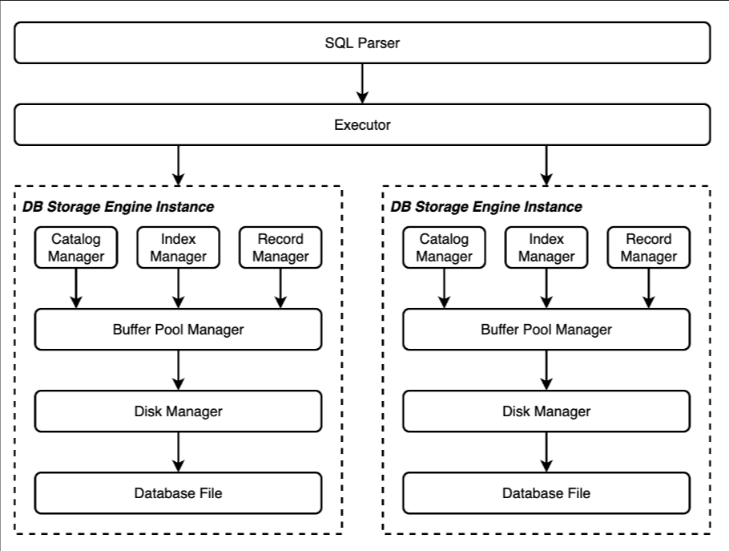

**索引定义**：对于表的主属性自动建立B+树索引，对于声明为`unique`的属性也需要建立B+树索引

**数据操作**: 可以通过`and`或`or`连接的多个条件进行查询，支持等值查询和区间查询。支持每次一条记录的插入操作；支持每次一条或多条记录的删除操作

支持3种**基本数据类型**：`integer`，`char(n)`，`float`

支持的**`SQL`语句**如下：

```sql
create database db0;
drop database db0;
show databases;
use db0;
show tables;
create table t1(a int, b char(20) unique, c float, primary key(a, c));
create table t1(a int, b char(0) unique, c float, primary key(a, c));
create table t1(a int, b char(-5) unique, c float, primary key(a, c));
create table t1(a int, b char(3.69) unique, c float, primary key(a, c));
create table t1(a int, b char(-0.69) unique, c float, primary key(a, c));
create table student(
  sno char(8),
  sage int,
  sab float unique,
  primary key (sno, sab)
);
drop table t1;
create index idx1 on t1(a, b);
-- "btree" can be replaced with other index types
create index idx1 on t1(a, b) using btree;
drop index idx1;
show indexes;
select * from t1;
select id, name from t1;
select * from t1 where id = 1;
-- note: use left association
select * from t1 where id = 1 and name = "str";
select * from t1 where id = 1 and name = "str" or age is null and bb not null;
insert into t1 values(1, "aaa", null, 2.33);
delete from t1;
delete from t1 where id = 1 and amount = 2.33;
update t1 set c = 3;
update t1 set a = 1, b = "ccc" where b = 2.33;
begin;
commit;
rollback;
quit;
execfile "a.txt";
```

# Part 1: Disk and Buffer Pool Manager

为提高磁盘 I/O 操作的效率，缓冲区与文件系统交互的单位是数据页（Page），数据页的大小应为文件系统与磁盘交互单位的整数倍。在本实验中，数据页的大小默认为 4KB

## Bitmap

位图页与数据页一样，占用`PAGE_SIZE`（**4KB**）的空间，标记一段连续页的分配情况

Bitmap Page由两部分组成，一部分是用于加速Bitmap内部查找的元信息（Bitmap Page Meta），它可以包含当前已经分配的页的数量（`page_allocated_`）以及下一个空闲的数据页(`next_free_page_`)，元信息所包含的内容可以由同学们根据实际需要自行定义。除去元信息外，页中剩余的部分就是Bitmap存储的具体数据

### Disk Manager

由于**数据页的大小为4KB**，如果全部用于记录是否已经分配，可能会存在数据溢出的问题。这就需要把一个位图页加一段连续的数据页看成数据库文件中的一个分区（Extent），再通过一个额外的元信息页来记录这些分区的信息。通过这种“套娃”的方式，来使磁盘文件能够维护更多的数据页信息。具体来说，使用 `PAGE_SIZE` 大小的元信息页来管理磁盘数据信息，包含了已分配的位图页和已分配的页的数量，大小为两个 `uint_32t` ，剩下的空间用来记录每一个位图页已分配的页的数量，其次是前面的位图页用于管理一段连续的数据页，依次类推

但是元数据所占用的数据页实际上是不存储数据库数据的,这就会导致物理页和逻辑页不匹配的问题，如下图:


因此需要通过函数`DiskManager::MapPageId(logical_page_id)`将逻辑页号转换成物理页号

### LRU

替换（即删除）与所有被跟踪的页相比最近最少被访问的页。在`lru_list_`中的页可以被替换。操作的唯一标识是`frame_id`

具体的实现是一个双向链表，容量为内存能容纳的最大数据页数。将内存中已经不再引用的数据页号丢进链表，当内存满了，需要回收一个页来开辟出新空间时，把链表最里面最早放入的页号对应的页给回收了（即把头部的给替换了）

### Bonus: Clock 

每个数据页一共设置3种状态，`USED` 和 `UNUSED` 以及`EMPTY`，如果数据没有使用过，则为`EMPTY`。对于初次加入的页面，设置为 `USED` ，在寻找待替换页面时，先遍历一遍 Replacer ，将 `USED` 设置为 `UNUSED` ，同时将待替换的页面设置为第一个遇到的 `UNUSED` 页面

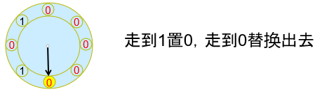

在`buffer_pool+manager.cpp`中, 选择不同的策略，允许主程序`main.cpp`都能够正常运行，并且能够通过所有的测试

```c++
BufferPoolManager::BufferPoolManager(size_t pool_size, DiskManager *disk_manager)
    : pool_size_(pool_size), disk_manager_(disk_manager) {
  pages_ = new Page[pool_size_];
  replacer_ = new LRUReplacer(pool_size_);
  // 使用LRUKreplacer
  //replacer_ = new LRUKReplacer(pool_size_);
  // 使用clockreplacer
  //replacer_ = new CLOCKReplacer(pool_size_);
  for (size_t i = 0; i < pool_size_; i++) {
    free_list_.emplace_back(i);
  }
}
```

### Bonus: LRU-K

参考了`CMU15445`最新的框架， `LRU_K`相较于`LRU`，额外考虑了数据的访问频率，而不仅仅关注最近访问时间。代码中维护了两个计数器：访问计数器和时间戳。当一个数据被访问时，访问计数器会增加，而时间戳会被更新。当需要替换数据时，`LRU_K`选择访问计数器最小的数据进行替换，这样可以更好地反映出数据的访问频率

### Buffer Pool Manager

Buffer Pool Manager负责从Disk Manager中获取数据页并将它们存储在内存中，并在必要时将脏页面转储到磁盘中（如需要为新的页面腾出空间），在复用`Page`对象之前必须将脏的内容转储到磁盘中。 `FlushPage` 函数将数据页**从缓冲区转储到磁盘**中来删除其 `IsDirty` 标志

同一个`Page`对象在系统的整个生命周期内，可能会对应很多不同的物理页。`Page`对象的唯一标识符`page_id_`用于跟踪它所包含的物理页，如果`Page`对象不包含物理页，那么`page_id_`必须被设置为`INVALID_PAGE_ID`

空闲页列表（`free_list_`）记录可以被替换的数据页

# Part 2: Record Manager

### Record

这部分实现了用于管理的记录（`Record`）以及相应的序列化和反序列化的操作，分为：

- 列（`Column`）：在`src/include/record/column.h`中被定义，用于定义和表示数据表中的某一个字段，即包含了这个字段的字段名、字段类型、是否唯一等等
- 模式（`Schema`）：在`src/include/record/schema.h`中被定义，用于表示一个数据表或是一个索引的结构。一个`Schema`由一个或多个的`Column`构成
- 域（`Field`）：在`src/include/record/field.h`中被定义，它对应于一条记录中某一个字段的数据信息，如存储数据的数据类型，是否是空，存储数据的值等等
- 行（`Row`）：在`src/include/record/row.h`中被定义，与元组的概念等价，用于存储记录或索引键，一个`Row`由一个或多个`Field`构成

使用魔数`MAGIC_NUM`做为简单的检验数据正确性的手段

`uint32_t`类型，表示在序列化和反序列化过程中`buf`指针向前推进了多少个字节

### Heap

所有的记录以堆表（Table Heap）的形式(其内部元素是无序的)进行组织,主要功能包括：记录的插入、删除与查找操作。不同的数据页（`TablePage`）之间通过双向链表连接。堆表中的记录通过`RowId`进行定位。`RowId`记录了该行记录所在的`page_id`和`slot_num`，其中`slot_num`用于定位记录在这个数据页中的下标位置。

`RowId`同时具有逻辑和物理意义，在物理意义上，它是一个64位整数，是每行记录的唯一标识；而在逻辑意义上，它的高32位存储的是该`RowId`对应记录所在数据页的`page_id`，低32位存储的是该`RowId`在`page_id`对应的数据页中对应的是第几条记录（详见#2.3.2）。`RowId`的作用主要体现在两个方面：一是在索引中，叶结点中存储的键值对是索引键`Key`到`RowId`的映射，通过索引键`Key`，沿着索引查找，我们能够得到该索引键对应记录的`RowId`，也就能够在堆表中定位到该记录；二是在堆表中，借助`RowId`中存储的逻辑信息（`page_id`和`slot_num`），可以快速地定位到其对应的记录位于物理文件的哪个位置

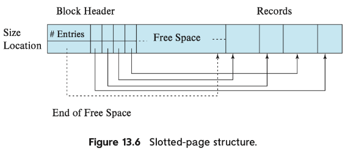

**插入**：采用了 First Fit 的策略，取出堆表的第一页尝试插入，如果已经不能插入（满了），那我们从缓冲池中取出新的一页，如果不能分配新的页，则插入返回失败，否则尝试插入，如此循环直到成功插入

**删除**：当需要从堆表中删除指定`RowId`对应的记录时，框架中提供了一种逻辑删除的方案，即通过打上Delete Mask来标记记录被删除，在之后某个时间段再从物理意义上真正删除该记录

**更新**：需要分两种情况进行考虑，一种是`TablePage`能够容纳下更新后的数据，直接在数据页中操作即可。如果没有足够的空间来更新，我们需要通过删除后插入来更新，具体来说, 在本节的 `UpdateTuple` 中通过返回值区分失败原因，执行相应的操作

```c++
class TablePage : public Page {
 public:
  enum class RetState { ILLEGAL_CALL, INSUFFICIENT_TABLE_PAGE,DOUBLE_DELETE,SUCCESS };
};
```

- `ILLEGAL_CALL` 代表非法调用，在传入 `slot_num` 无效返回 $\to$ 直接返回 `false`
- `INSUFFICIENT_TABLE_PAGE` 代表当前页的空间不足以放下一个元组 $\to$ 删除旧元组，将其插入到新的一页
- `DOUBLE_DELETE` 代表待更新元组已被删除 $\to$ 标记`IsDirty`为脏，返回 `true`
- `SUCCESS` 代表更新成功 $\to$ 直接返回 `false`

### Table Iterator

给Part5 的执行器（`Executor`）提供接口，实现表的遍历。实现了重载的 `==` `!=` `*` `->`，前置 `++`  运算符功能（后置 `++` 拷贝一份原指针再调用前置 `++` ）

我们调用 `GetNextTupleRid(args)` 得到下一个元组，如果成功，那么我们移动到下一条记录再返回即可，否则意味着下一个元组不在当前页，我们调用 `GetNextPageId()` 从缓冲池中取出下一页并获取第一个元组，移动到这条记录再返回

# Part 3: Index Manager

### B Plus Tree

本部分为整个程序中最为复杂的一部分

 B+树以`page`为基本单元，其数据都保存在`page`中，根据节点数据形式的不同，分为`Internal Page`和`Leaf Page`，可以通过类型转换将`page`转化为`Internal Page`或`Leaf Page`

中间结点`BPlusTreeInternalPage`不存储实际的数据，它只按照顺序存储个键和个指针（这些指针记录的是子结点的`page_id`）。由于键和指针的数量不相等，因此我们需要将第一个键设置为`INVALID`，也就是说，顺序查找时需要从第二个键开始查找。在任何时候，每个中间结点至少是半满的（`Half Full`）。当删除操作导致某个结点不满足半满的条件，需要通过合并（`Merge`）相邻两个结点或是从另一个结点中借用（移动）一个元素到该结点中（`Redistribute`)来使该结点满足半满的条件。当插入操作导致某个结点溢出时，需要将这个结点分裂成为两个结点

叶结点`BPlusTreeLeafPage`存储实际的数据，它按照顺序存储个键和个值，其中键由一个或多个`Field`序列化得到，在`BPlusTreeLeafPage`类中用模板参数`KeyType`表示；值实际上存储的是`RowId`的值，它在`BPlusTreeLeafPage`类中用模板参数`ValueType`表示。叶结点和中间结点一样遵循着键值对数量的约束，同样也需要完成对应的合并、借用和分裂操作。

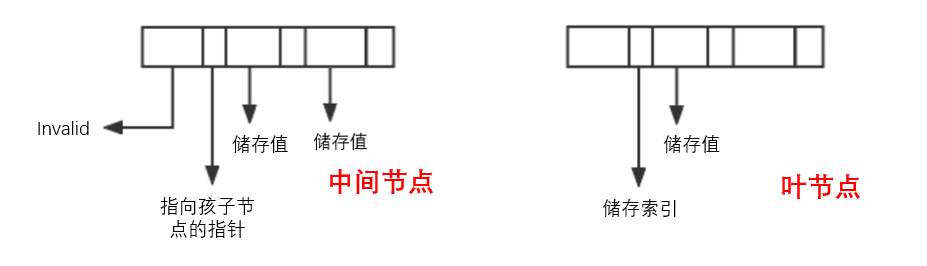

在操作过程中，B+树通过不断地`Fetchpage`从`buffer pool manager`处获取`Page`，同时`UnpinPage`并标记为脏以更新磁盘处的B+树数据。B+树索引中的节点大小应与缓冲区的数据页大小相同（为**4K**），B+树的叉数由节点大小与索引键大小计算得到

`Key`: 索引键是索引列的值序列化后得到的字符串.索引列的长度作为参数在构造`BPlusTreeIndex`时作为参数传入，保存在各个节点中，方便根据`key_size`确定每个键值对在模板中的位置，从而读写

`Value`: 值类型可能不同，叶结点存储`RowId`，而非叶结点存储`page_id`

`KeyManager`: 负责对`GenericKey`进行序列化/反序列化和比较

向外提供的接口主要有：

```c++
bool IsEmpty() const;
bool Insert(const KeyType &key, const ValueType &value, Transaction *transaction = nullptr);
void Remove(const KeyType &key, Transaction *transaction = nullptr);
bool GetValue(const KeyType &key, std::vector<ValueType> &result, Transaction *transaction = nullptr);
```

### Index Iterator

与堆表`TableHeap`对应的迭代器类似，在本节中，为B+树索引也实现一个迭代器。该迭代器能够将所有的叶结点组织成为一个单向链表，然后可以对所有保存的数据进行一次线性的遍历，在B+树的体系结构中，实现的迭代器能够获取B+树索引的头节点以及对于单个迭代器节点自增的操作，从而为上层程序获取单个元组的信息提供可能

这部分的代码较为简单，只需要实现自增和等价比较的几个算符即可，其自身的序号通过`index_`这个私有变量进行描述

但是，额外需要注意的是，自增时需要考虑跨`Page`以及到达末尾的情况

# Part 4: Catalog Manager

负责管理和维护数据库的所有模式信息，包括：

- 数据库中所有表的定义信息，包括表的名称、表中字段（列）数、主键、定义在该表上的索引
- 表中每个字段的定义信息，包括字段类型、是否唯一等
- 数据库中所有索引的定义，包括所属表、索引建立在那个字段上等

数据库中定义的表和索引在内存中以`TableInfo`和`IndexInfo`的形式表现，另外还需要一个数据页和数据对象`CatalogMeta`来记录和管理这些表和索引的元信息被存储在哪个数据页中。`CatalogMeta`的信息将会被序列化到数据库文件的第`CATALOG_META_PAGE_ID`号数据页中（逻辑意义上），`CATALOG_META_PAGE_ID`默认值为$0$

`CatalogManager`能够在数据库实例（`DBStorageEngine`）初次创建时（`init = true`）初始化元数据；并在后续重新打开数据库实例时，从数据库文件中加载所有的表和索引信息，构建`TableInfo`和`IndexInfo`信息置于内存中。此外，`CatalogManager`类还需要对上层模块提供对指定数据表的操作方式，如`CreateTable`、`GetTable`、`GetTables`、`DropTable`、`GetTableIndexes`；对上层模块提供对指定索引的操作方式，如`CreateIndex`、`GetIndex`、`DropIndex`

更为具体的一些实现可以见于代码，由于这是整个实验中最简单的一部分，序列化和反序列化也和`part 2`类似，因此不再赘述

# Part 5: Planner and Executor

`Planner`（执行计划生成器）的主要功能是根据解释器（`Parser`）生成的语法树，通过`Catalog Manager` 提供的信息检查语法树中的信息是否正确，如表、列是否存在，谓词的值类型是否与column类型对应等等，随后将这些词语转换成可以理解的各种` c++ 类`。解析完成后，`Planner`根据改写语法树后生成的`Statement`结构，生成对应的`Plannode`，并将`Plannode`交由`Executor`进行执行

`Executor`（执行器）的主要功能是遍历`Planner`生成的计划树，将树上的 `PlanNode `替换成对应的` Executor`，并调用` Record Manager`、`Index Manager `和 `Catalog Manager `提供的相应接口进行执行。`Executor`采用的是火山模型，提供迭代器接口，每次调用时会返回一个元组和相应的 RID

`Planner`已经由助教给出，我完成的部分为执行器中的一些函数以及seqscan，insert，update，delete, indexscan这5个算子

语法树中保存着命令执行需要的各种信息，根据信息和指令对于各项数据进行调用(下图对应`SQL`语句`select * from t1 where id = 1 and name = "str";`)

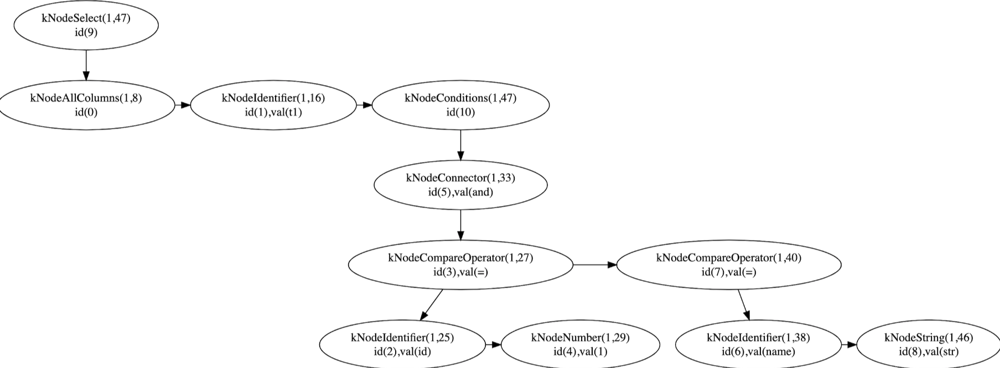

在遍历和获取上：

- 在`database`层面，通过`dbs_`这个`unordered_map`传入数据库名以获取当前的数据库存储引擎的指针，通过该指针可以调用数据库中的各项次级结构

```c++
 private:
  std::unordered_map<std::string, DBStorageEngine *> dbs_; /** all opened databases */
  std::string current_db_;                                 /** current database */
```

- 在`schema`层面，通过`DBStorageEngine`下的次级结构`CatalogManager`可以获取有关单个表的信息，保存在`TableInfo`中间
- 在`index`层面，从`Catalogmanager`中获取相应的信息
- 在`tuple`层面，通过`TableHeap`进行`GetTuple`操作，从而获取单个元组的数据

需外额外注意的是，在完成该部分的时候，对前面的许多函数和参数和类进行了更改，比如在`Row.h`和`Row.cpp`中定义了比较函数

```c++
  bool operator < (const Row &t)const {
     for(uint32_t i = 0; i < GetFieldCount();i++) {
         if (GetField(i)->CompareEquals(*t.GetField(i))) 
             continue;
         return GetField(i)->CompareLessThan(*t.GetField(i));
     }
     return false;
    }
  bool operator == (const Row &t)const {
      for(uint32_t i = 0; i < GetFieldCount();i++) {
          if(!GetField(i)->CompareEquals(*t.GetField(i))) 
              return false;
      }
      return true;
  }
```

在`instance` 两个文件中加上物理删除的方法，修改B+树（因为测试的时候发现一分裂节点就错了x)等等

# 测试允许

### 通过全部测试点

并且在验收时已经展示过把`b_plus_tree_test`的`n`从`30`开到`300`，可以正确通过

> 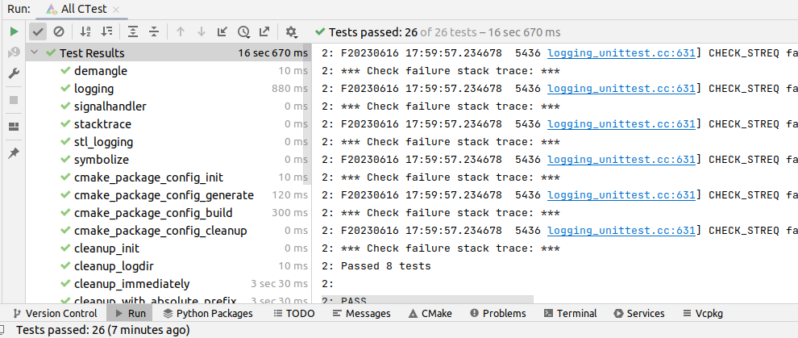

### 验收命令

```sql
create database db0;
use db0;
create table account(id int, name char(16), balance float, primary key(id));
execfile "account00.txt";
execfile "account01.txt";
execfile "account02.txt";
execfile "account03.txt";
execfile "account04.txt";
execfile "account05.txt";
execfile "account06.txt";
execfile "account07.txt";
execfile "account08.txt";
execfile "account09.txt";
select * from account;
# 查询测试F
select * from account where id <>12519999;
select * from account where id = 12519999;
select * from account where balance =514.35;
select * from account where name = "name56789";
# 多条件查询
select id, name from account where balance >= 1 and balance < 1000;
select name, balance from account where balance > 500 and id <= 12519999;
select * from account where id < 12515000 and name > "name14500";
select * from account where id < 12500200 and name < "name00100";
# 唯一索引
insert into account values(12500000, "name10000", 20);
insert into account values(1, "name92000", 20);
# 更新
update account set balance = 5000 where name ="name09991";
select * from account where name ="name09991";
update account set balance = 5000 where id > 12509500;
select * from account;
# 删除
drop table account;
show tables;
drop database db0;
show databases;
```

### 插入速度

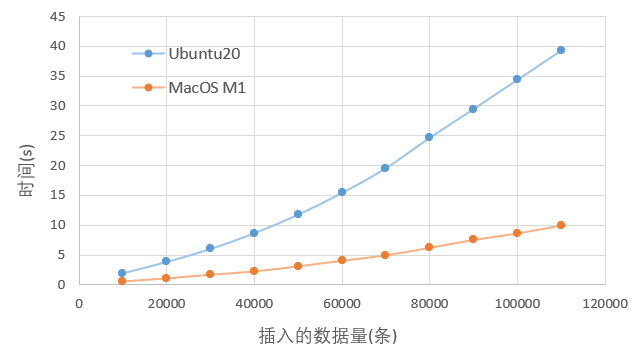

# 课程建议

1. 我是单独完成的`MiniSQL`，收获非常大，但是完成本次作业花费了我大量的时间（可以见下表），也挤占了数据库期末考试的复习时间以及其他课程的时间，再加上数据库期末考的内容太多、以及春学期还做了一个图书管理系统的大作业，导致课程压力非常大，但是`MiniSQL`最后在总评中只占到了可怜的15分（甚至我在考试前3天才完成了`MiniSQL`的验收，因此复习十分仓促，题目都做得不够熟练，在考试这么大题量的情况下感觉考得不是很理想），而期末50分，因此建议改变分数结构，提高`MiniSQL`的比例，或者可以把春学期的那4个操作`MySQL`的几个无聊的小实验去掉，感觉这4个实验非常没必要

   | 环境配置                  | part1 | part2 | part3                                             | part4 | part5 | 报告撰写 |
   | ------------------------- | ----- | ----- | ------------------------------------------------- | ----- | ----- | -------- |
   | 1h+3h（中间电脑坏了一次） | 5h    | 6h    | 28h(通过part3的测试点)+27h(修改由part5发现的问题) | 3h    | 20h   | 3h       |

2. 实验文档还不够完善，尤其是part5，大量的叙述都在说是如何实现的`Planner`(虽然，我们调试，需要知道`Planner`的原理，并且学会通过查看语法树的输出来调试`Executor`）, 但是有关`Executor`的具体指导太少了，我刚开始根本不知道我到底要干点啥，也不知道那些参数到底要怎么用，后来研究无果后问了好多次助教才逐渐明白这个要干什么。不同于前面几个部分的实验，我在这部分花了大量的时间，总得来说问题大量出现在我不到究竟要干什么上

3. 实验指导文件虽然提供的方法非常详实，适合不同开发习惯的同学进行开发，但是这也会导致同学们不知道应该选用哪个工具进行开发。实际上`CLion`应该是最优的开发工具，它自带的调试功能非常方便，工欲善其事必先利其器，我建议在指导文档的环境配置部分安利`CLion`， 这会减少很多的开发问题。而且在Linux系统上，可以一行命令安装

   ```shell
   sudo snap install clion --classic
   ```

4. 许多同学的工程能力比较弱（比如我，多亏了助教教了我两次怎么对一些刁钻的问题`debug`），因此可以考虑录制一下简单的调bug的技巧的视频

5. 本框架是第二年还不完善经常会在改动可以理解，但是最后改了点测试数据属于让我破防

6. 在Part 3中，我建议提供索引接口和一个使用不同数据结构实现的示例索引。B+树索引难度较大，但后续模块需要使用它。为避免单个同学拖累整个小组进度，可让其他同学在编写B+树时继续进行后续模块开发，以平衡工作量。本模块架构复杂且注释不清晰，为帮助同学们更好理解，可让允许自行构建B+树架构，或者修改现有框架作为参考。并且可以考虑使用模板，许多函数都重写写一遍真是太难受了。

7. 提高模块之间的分化性，降低耦合度。因为目前的框架不同部分之间的关联性太强了，导致很难小组分工，尤其是实现最后一个执行器的时候，发现很多地方都写错了，尤其是b+树，真的超级难受。（或者可以让test更加全面？以减少感觉自己写对了后面又暴雷）

8. 大量时间花在了理解框架上，而文字的表达又不太生动，并且会造成很多困惑，如果有可能的话可以录制一些进行解释的视频

9. 建议汇总一些普遍遇到过的问题，比如

```bash
unknown file: Failure
C++ exception with description "std::exception" thrown in the test body
```

这是由于文件夹权限导致的，我当时`debug`搞了很久，一直以为是程序的问题，

> 再比如，比如这样神奇的错误会出在注释上（虽然可能是cion调试好像有些时候会出现跳行的操作）
>
> 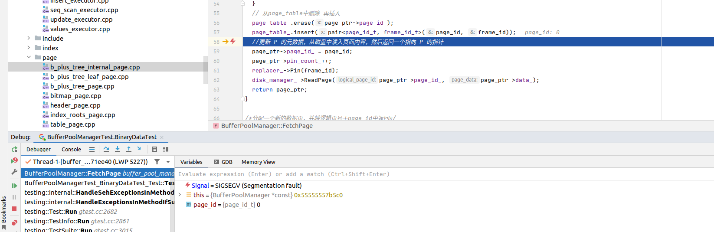
>
> 当我给代码加上一个一个`LOG`之后，就莫名奇妙得通过了测试
>
> 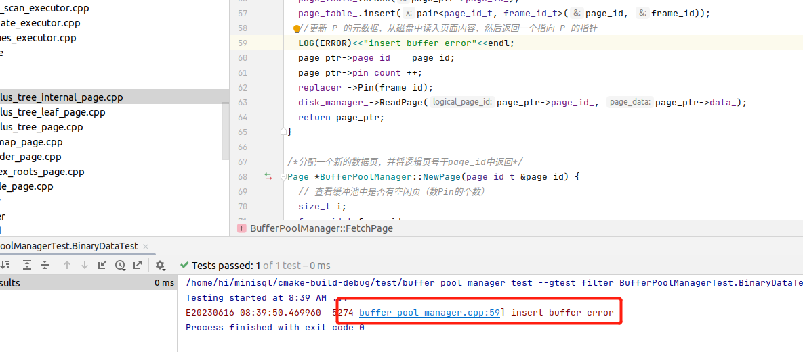
>
> 还有一些另外的奇怪的问题（后来发现都是虚拟机的问题）
>
> [select之后莫名退出]
>
> 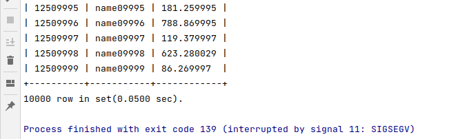
>
> [index==-1不成立，但是break了]
>
> 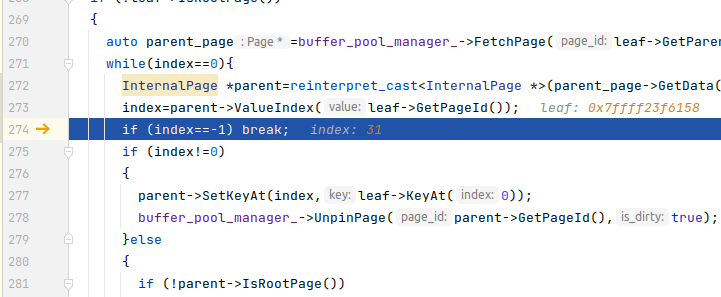
>
> [查询时现实内存分配失败]
>
> 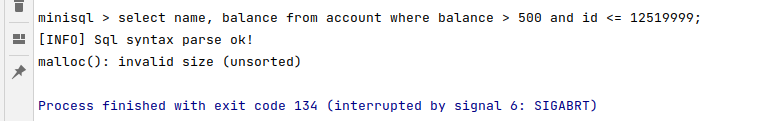

结果浪费了大量时间，可以通过test文件同级目录下手动建立`databases`文件夹，或者

```bash
sudo chmod +rwx /path/to/folder #/path/to/folder为你的文件地址
```

来解决。另一部分问题出在了虚拟机内存上管理模式上，开大内存后解决了这些问题

# 致谢

最后，感谢，**聂俊哲**助教，在整个程序的编写过程中，咨询了他大量的问题。一个学期的实验课我也大部分都去听了，助教每次都会认真讲解作业，并且耐心答疑，甚至帮我`de`过几个`bug`
